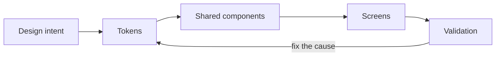

<h1 align="center">Mateus Vidal</h1>

  Front-end developer. Design systems, TypeScript, React.

  I build the layer between what a design promises and what the browser actually ships.

---

Design was my way into engineering. That still shows up in how I work: I notice the
4px problem, and I also know what it costs to fix it properly instead of nudging a
margin. But the code is the job now. I write production TypeScript, own front-end
architecture, and spend most of my thinking on the system rather than the screen.

If I have one habit worth hiring, it's this: when something breaks twice the same way,
I stop patching instances and go fix the cause. Usually that means the system was
missing a piece.

I'm in the middle of a deliberate shift right now, from building interfaces to
engineering them. Past the stage where tools do my thinking. Still filling in
fundamentals, on purpose.

## How I work

Design systems are code to me, not a Figma page. I build tokens in two tiers so call
sites reference intent rather than a hex value, and I put new patterns into the shared
layer before any screen uses them. It's slower for the first two screens and much
faster for the next twenty.

Abstraction has to earn itself. Two hardcoded values in two files means a token is
missing. One value doesn't mean anything yet.

Accessibility I treat as a build-time constraint. Contrast, visible focus, reduced
motion. It's cheap as a requirement and expensive as a retrofit, and I don't ship past it.

I work from numbers, not screenshots. Exact values from the source, not a rendered PNG
and a guess. This removes a whole category of arguing with designers about whether
something is "close enough."

Where a design and an established system disagree, the system wins and the design
adapts. That's what keeps twenty pages looking like one product.

And I write things down as I go — architecture notes, conventions, the reasoning behind
anything non-obvious. Partly for whoever comes next. Mostly for me in six months.

## The stack

<table>
<tr>
<td valign="top" width="180">
<strong>Daily</strong> 
I reach for these without thinking
</td>
<td valign="top">

</td>
</tr>
<tr>
<td valign="top">
<strong>Comfortable</strong> 
solid working knowledge, used when the job needs it
</td>
<td valign="top">

</td>
</tr>
<tr>
<td valign="top">
<strong>Learning now</strong> 
actively in progress, not claiming these yet
</td>
<td valign="top">

</td>
</tr>
</table>

The third row is the honest one. I could pad the top row with everything I've touched
once, but a lead who hires on that list finds out in week two.

## What I'm fixing in myself

The JavaScript pass I'm doing now is the deep one, not the tutorial one. Event loop,
closures, prototypes, why React behaves the way it does under the hood.

Testing is where I'm thinnest. I've historically validated visually and by hand, which
works right up until it doesn't. Building real testing discipline is my current project,
and I'd rather tell you than have you find it in a code review.

I'm also learning to treat the pipeline as part of the product. Automated checks,
reproducible builds, deploys that aren't a manual ritual.

Last one: I'm reading more code than I write. Nothing has improved my engineering faster
than studying a well-architected codebase instead of only producing my own.

## On AI tools

I use them heavily and I think the how matters more than the whether.

I build tooling rather than paste output — reusable workflows and documented project
context, so what comes back is grounded in the actual codebase. Anything automated
proposes; nothing writes to source unsupervised. And I own every line that ships. If I
can't explain it, it doesn't go in. Speed bought against understanding isn't speed.

## Fit

I do my best work where design precision and front-end architecture overlap. Design
systems, component architecture, motion, accessibility, interfaces that have to survive
real product complexity. I want a team that writes things down and gives blunt feedback.

If you're a lead sizing me up: I'm strong on design-to-code quality and system thinking,
I'm honest about the depth I'm still building, and I take "the standard is higher than
that" well.

---

  
  

  Open to conversations about front-end and design-systems work.

